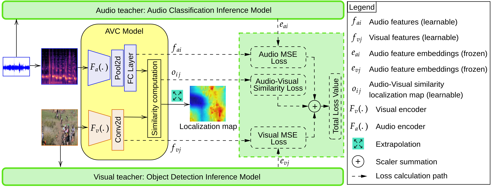

## Acoustic and Visual Knowledge Distillation for Contrastive Audio-Visual Localization

[**check the paper**](https://dl.acm.org/doi/10.1145/3577190.3614144)<br>

<div align="center">
  
</div>

#### Setup the environment:
After creating a virtual environment install the requirments.

```
pip install -r requirements.txt
```

#### Model: 
|    Method   |    Train Set   |     Download link    |
|:-----------:|:--------------:|:---------------------|
|  AVC-144k   | VGG-Sound 144k | [checkpoints (2.5 GB)](https://ubipt-my.sharepoint.com/:u:/g/personal/ehsan_yaghoubi_ubi_pt/EXKkjdlDSmdFtsEyD01DQpYBvIrNcdbr2_Nd_TF_1CHHfA?e=5MtuLm) |
  
#### Test sets (1 frame + 10s audio):
[Flickr-5k (4 GB)](https://ubipt-my.sharepoint.com/:u:/g/personal/ehsan_yaghoubi_ubi_pt/EcvhlIYJJbFKhyzx3zoy-vwBlYwikiV5BUCjKznbMPOUOQ?e=nibS1U) 

[VGG-SS (5.6 GB)](https://ubipt-my.sharepoint.com/:u:/g/personal/ehsan_yaghoubi_ubi_pt/EavcYYDVKoRAgIC8Tq1NmbABLUBlsg3KbOHjw6AqOXl9FA?e=2LGGSj)

#### Test on Flickr dataset:
```
python test_N_times.py --test_data_path /path/to/Flickr-SoundNet/ \
    --test_gt_path /path/to/Flickr-SoundNet/Annotations/ \
    --model_dir checkpoints \
    --experiment_name vggsound_144k \
    --save_visualizations \
    --testset 'flickr' \
    --alpha 0.4
```

#### Visualizations:
The code has the option to save the visualizations. 
<div align="center">
  
</div>

#### Citation:

```
@inproceedings{10.1145/3577190.3614144,
author = {Yaghoubi, Ehsan and Kelm, Andre Peter and Gerkmann, Timo and Frintrop, Simone},
title = {Acoustic and Visual Knowledge Distillation for Contrastive Audio-Visual Localization},
year = {2023},
isbn = {9798400700552},
publisher = {Association for Computing Machinery},
address = {New York, NY, USA},
url = {https://doi.org/10.1145/3577190.3614144},
doi = {10.1145/3577190.3614144},
abstract = {This paper introduces an unsupervised model for audio-visual localization, which aims to identify regions in the visual data that produce sounds. Our key technical contribution is to demonstrate that using distilled prior knowledge of both sounds and objects in an unsupervised learning phase can improve performance significantly. We propose an Audio-Visual Correspondence (AVC) model consisting of an audio and a vision student, which are respectively supervised by an audio teacher (audio recognition model) and a vision teacher (object detection model). Leveraging a contrastive learning approach, the AVC student model extracts features from sounds and images and computes a localization map, discovering the regions of the visual data that correspond to the sound signal. Simultaneously, the teacher models provide feature-based hints from their last layers to supervise the AVC model in the training phase. In the test phase, the teachers are removed. Our extensive experiments show that the proposed model outperforms the state-of-the-art audio-visual localization models on 10k and 144k subsets of the Flickr and VGGS datasets, including cross-dataset validation.},
booktitle = {Proceedings of the 25th International Conference on Multimodal Interaction},
pages = {15–23},
numpages = {9},
keywords = {Audio-visual representation learning, Knowledge distillation, acoustic-visual learning., cross-modal learning, multi-modal teacher-student, sound-image localization},
location = {<conf-loc>, <city>Paris</city>, <country>France</country>, </conf-loc>},
series = {ICMI '23}
}
```


